---
## Front matter
title: "ОТЧЕТ
ПО ЛАБОРАТОРНОЙ РАБОТЕ №3"
subtitle: «Система контроля версий Git»
author: "Воробчук Лилия Андреевна"

## Generic otions
lang: ru-RU
toc-title: "Содержание"

## Bibliography
bibliography: bib/cite.bib
csl: pandoc/csl/gost-r-7-0-5-2008-numeric.csl

## Pdf output format
toc: true # Table of contents
toc-depth: 2
lof: true # List of figures
lot: true # List of tables
fontsize: 12pt
linestretch: 1.5
papersize: a4
documentclass: scrreprt
## I18n polyglossia
polyglossia-lang:
  name: russian
  options:
	- spelling=modern
	- babelshorthands=true
polyglossia-otherlangs:
  name: english
## I18n babel
babel-lang: russian
babel-otherlangs: english
## Fonts
mainfont: PT Serif
romanfont: PT Serif
sansfont: PT Sans
monofont: PT Mono
mainfontoptions: Ligatures=TeX
romanfontoptions: Ligatures=TeX
sansfontoptions: Ligatures=TeX,Scale=MatchLowercase
monofontoptions: Scale=MatchLowercase,Scale=0.9
## Biblatex
biblatex: true
biblio-style: "gost-numeric"
biblatexoptions:
  - parentracker=true
  - backend=biber
  - hyperref=auto
  - language=auto
  - autolang=other*
  - citestyle=gost-numeric
## Pandoc-crossref LaTeX customization
figureTitle: "Рис."
tableTitle: "Таблица"
listingTitle: "Листинг"
lofTitle: "Список иллюстраций"
lotTitle: "Список таблиц"
lolTitle: "Листинги"
## Misc options
indent: true
header-includes:
  - \usepackage{indentfirst}
  - \usepackage{float} # keep figures where there are in the text
  - \floatplacement{figure}{H} # keep figures where there are in the text
---

# Цель работы

изучить идеологию и применение средств контроля версий.
Приобрести практические навыки по работе с системой git.

# Выполнение лаборатнорной работы

1. Настройка Github. Создаю учётную запись на сайте https://github.com/ и
заполняю основные данные. (рис. [-@fig:001])

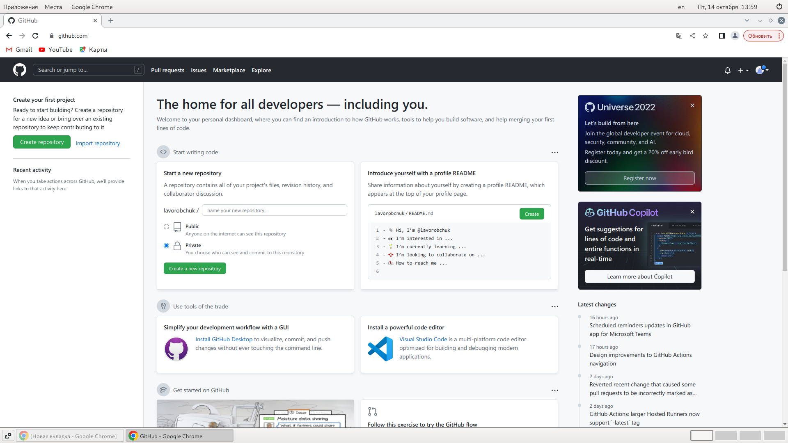{ #fig:001 width=70% }

2. Базовая настройка git. Делаю предварительную конфигурацию git. Ввожу в
терминале команды, указав имя и email владельца репозитория. Настраиваю
utf-8 в выводе сообщений. Задаю имя начальной ветки. (рис. [-@fig:002])

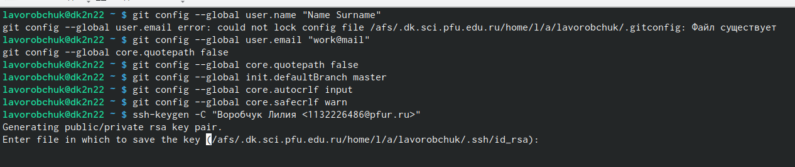{ #fig:002 width=70% }

3. Создание SSH-ключа. Генерирую пару ключей (приватный и открытый).
Далее загружаю сгенерированный открытый ключ. Для этого захожу на сайт
http://github.org/ под своей учётной записью и перехожу в меню Setting .
После этого выбираю в боковом меню SSH and GPG keys и нажимаю кнопку
New SSH key. Скопировав из локальной консоли ключ в буфер обмена,
вставляю его в появившееся на сайте поле и указываю для ключа имя (Title). (рис. [-@fig:003]) (рис. [-@fig:004])

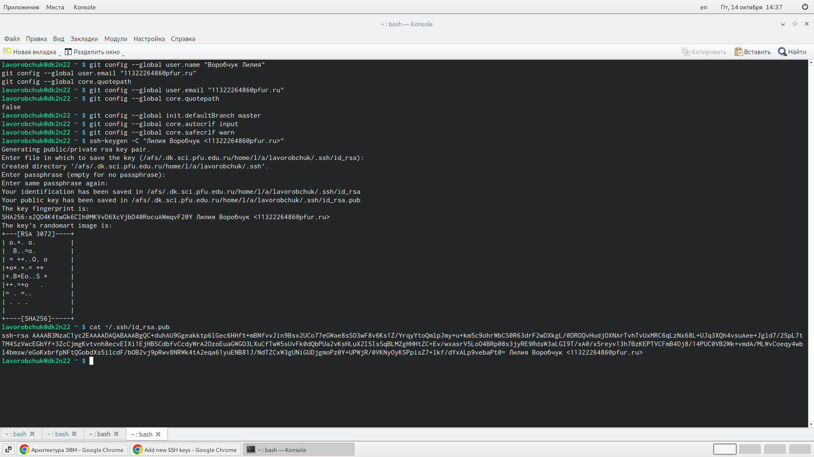{ #fig:003 width=70% }

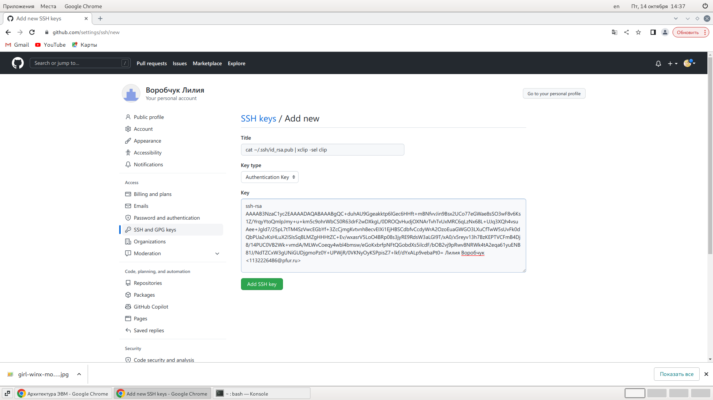{ #fig:004 width=70% }

4. Создание рабочего пространства и репозитория курса на основе
шаблона. Открываю терминал и создаю каталог для предмета «Архитектура
компьютера»

5. Создание репозитория курса на основе шаблона. Перехожу на станицу репозитория с шаблоном курса
https://github.com/yam adharma/course-directory-student-template. Далее
выбираю Use this template. (рис. [-@fig:005])

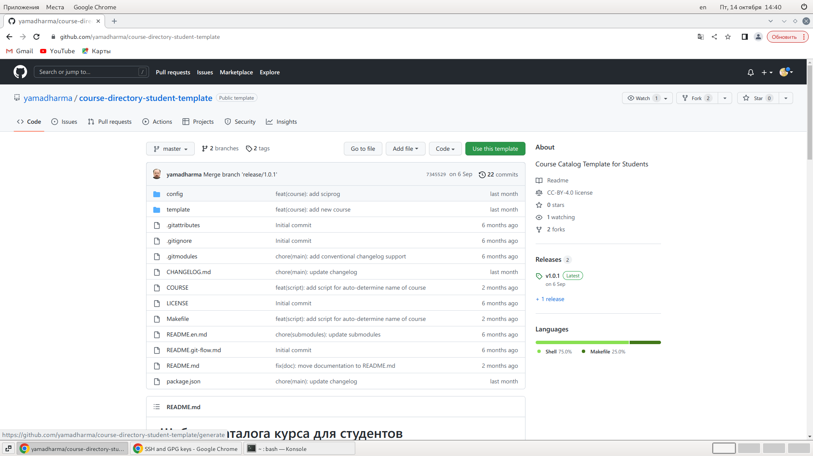{ #fig:005 width=70% }

6. В открывшемся окне задаю имя репозитория (Repository name) study_2022–
2023_arh-pc и создаю репозиторий https://github.com/lavorobchuk/study_2022-
2023_arh-pc.git (рис. [-@fig:006])

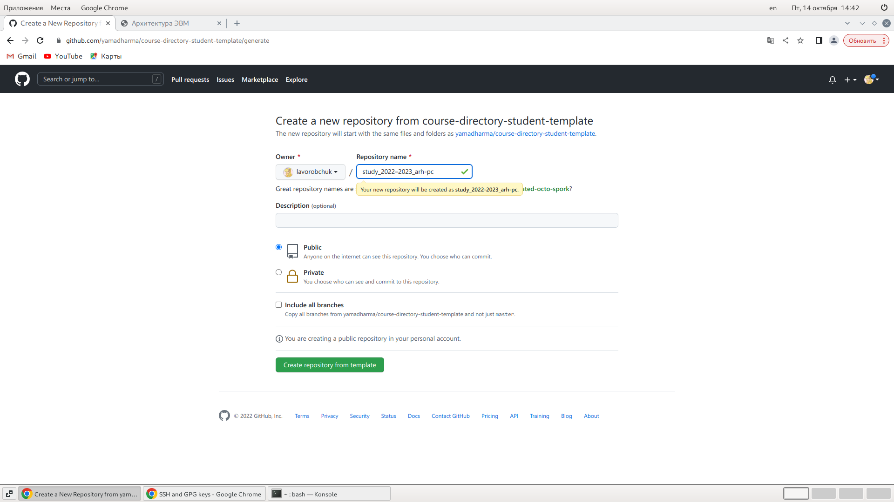{ #fig:006 width=70% }

7. Открываю терминал, перехожу в каталог курса: cd ~/work/study/2022-
2023/"Архитектура компьютера" и клонирую созданный репозиторий (рис. [-@fig:007])

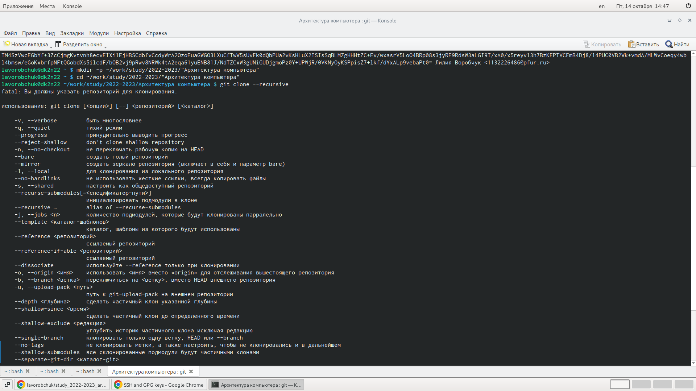{ #fig:007 width=70% }

8. Ссылку для клонирования копирую на странице созданного репозитория Code
-> SSH (рис. [-@fig:008])

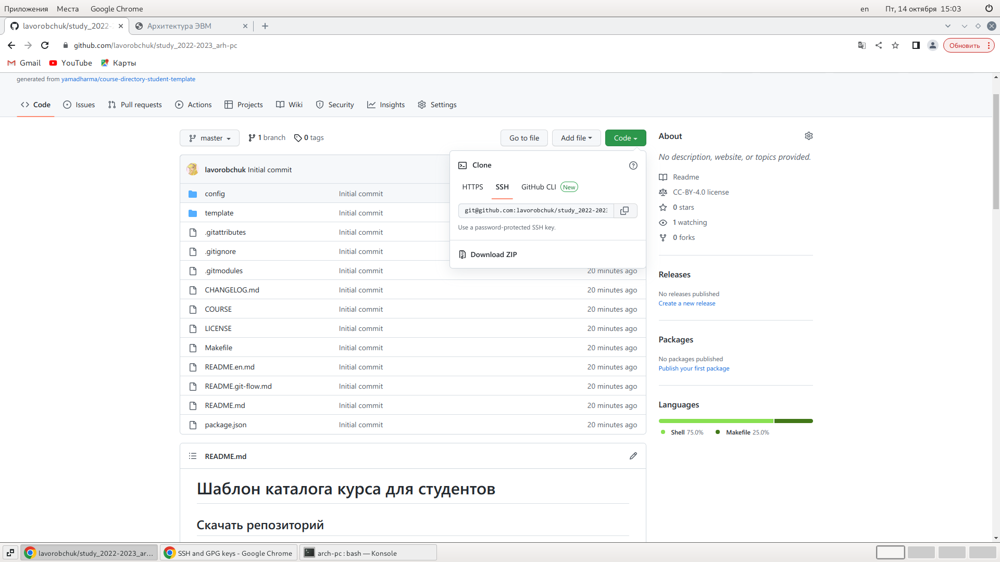{ #fig:008 width=70% }

9. Настройка каталога курса. Перехожу в каталог курса, удаляю лишние файлы,
создаю необходимые каталоги, отправляю файлы на сервер (рис. [-@fig:009]) (рис. [-@fig:010])

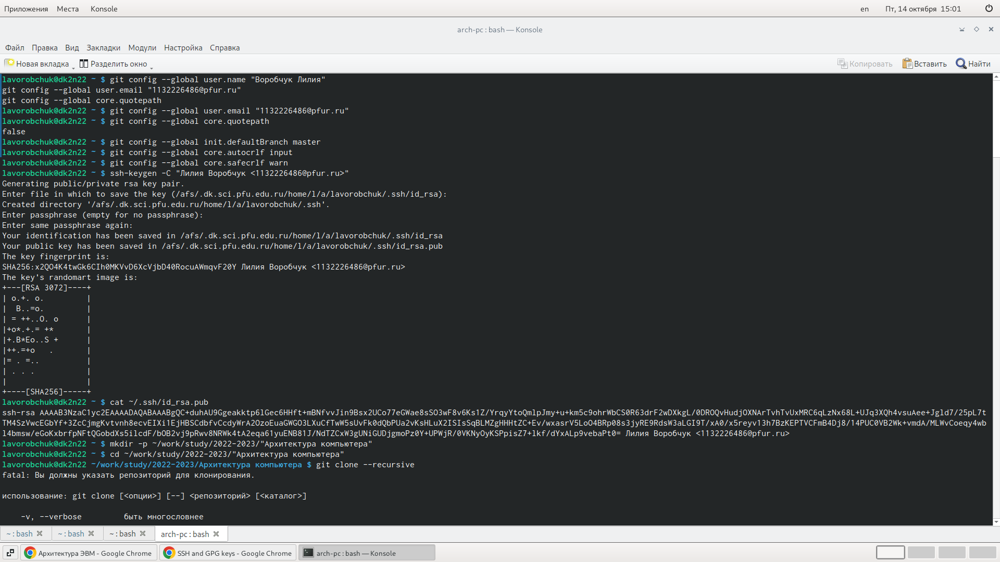{ #fig:009 width=70% }

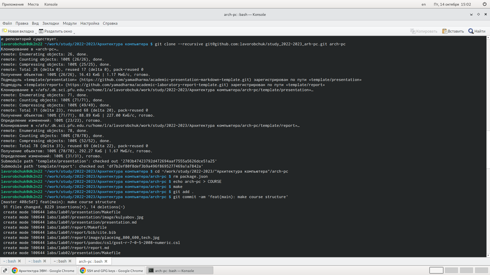{ #fig:010 width=70% } 

Проверяю правильность создания иерархии рабочего пространства в локальном
репозитории и на странице github.

# Cамостоятельная работа
1. Этот отчёт помещаю в соответствующий каталог рабочего пространства
(labs>lab03>report)

2. Копирую отчеты по выполнению предыдущих лабораторных работ в
соответствующие каталоги созданного рабочего пространства и загружаю файлы
на github. (рис. [-@fig:011]) (рис. [-@fig:012]) (рис. [-@fig:013]) (рис. [-@fig:014])

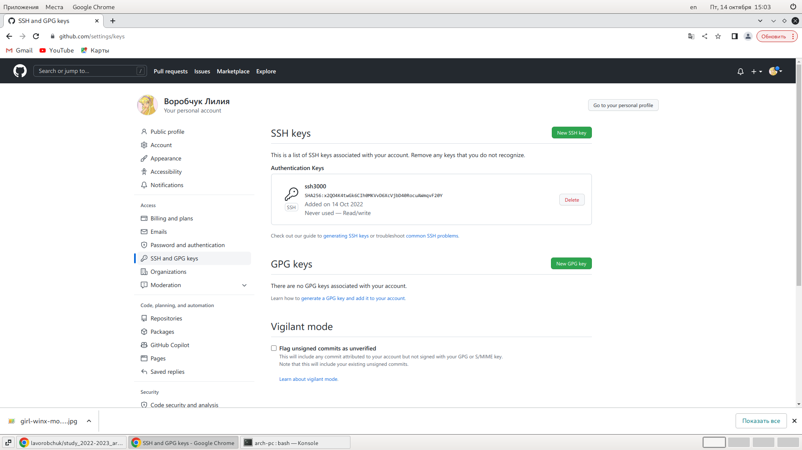{ #fig:011 width=70% }

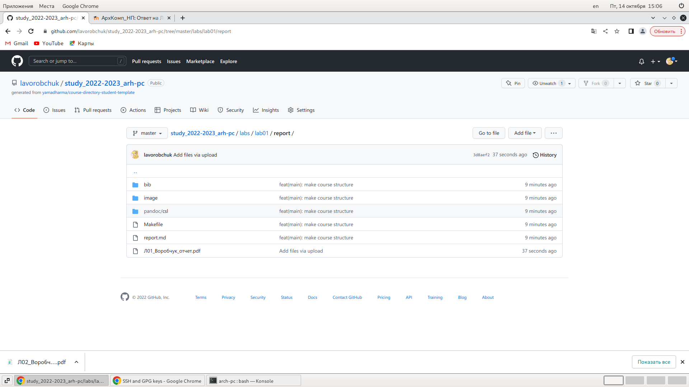{ #fig:012 width=70% }

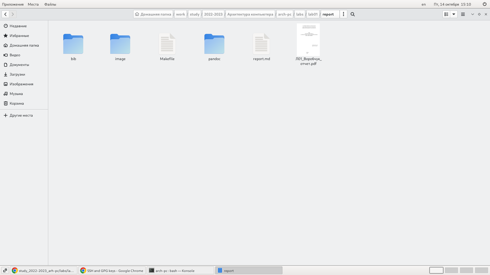{ #fig:013 width=70% }

{ #fig:014 width=70% }

# Вывод 
В ходе выполнения данной лабораторной работы я научилась работать с
системой Git, изучила идеологию и применение средств контроля версий.
